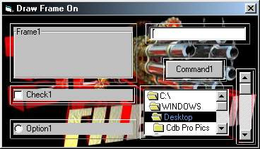



## DrawFrameOn

### Description

This code draws transparent frames around any

control in any style you want and it's so easy

to use !
 
### More Info
 

             |
---                |---
**Submitted On**   |2000-07-26 13:33:26
**By**             |[Roee Golan](https://github.com/Planet-Source-Code/PSCIndex/blob/master/ByAuthor/roee-golan.md)
**Level**          |Intermediate
**User Rating**    |4.3 (13 globes from 3 users)
**Compatibility**  |VB 6\.0
**Category**       |[Graphics](https://github.com/Planet-Source-Code/PSCIndex/blob/master/ByCategory/graphics__1-46.md)
**World**          |[Visual Basic](https://github.com/Planet-Source-Code/PSCIndex/blob/master/ByWorld/visual-basic.md)
**Archive File**   |[CODE\_UPLOAD81887262000\.zip](https://github.com/Planet-Source-Code/roee-golan-drawframeon__1-10084/archive/master.zip)

